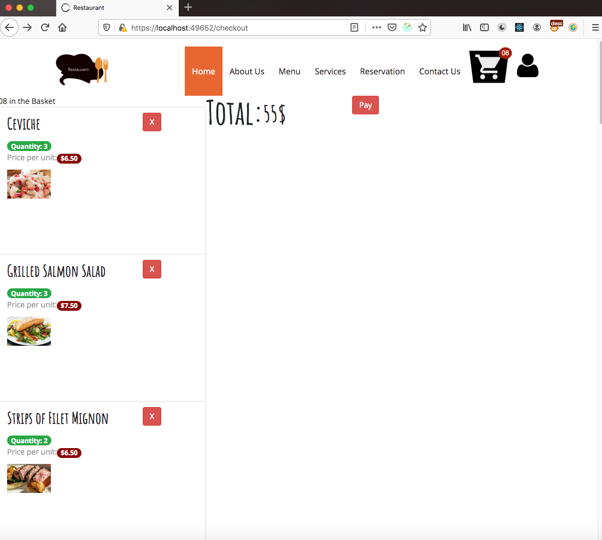
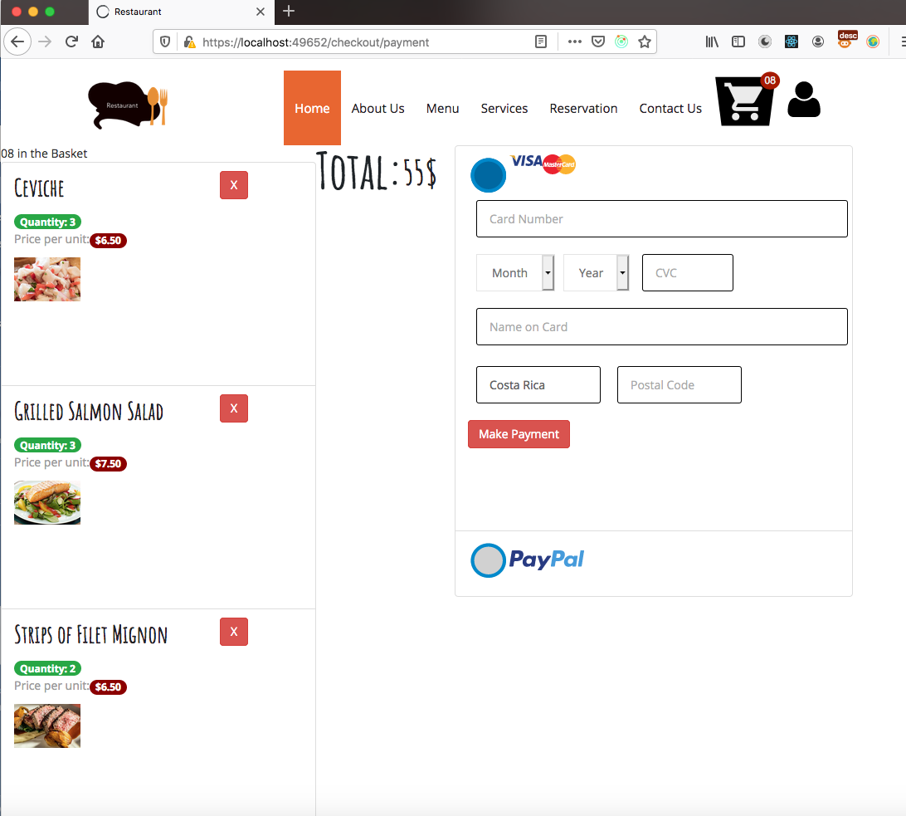
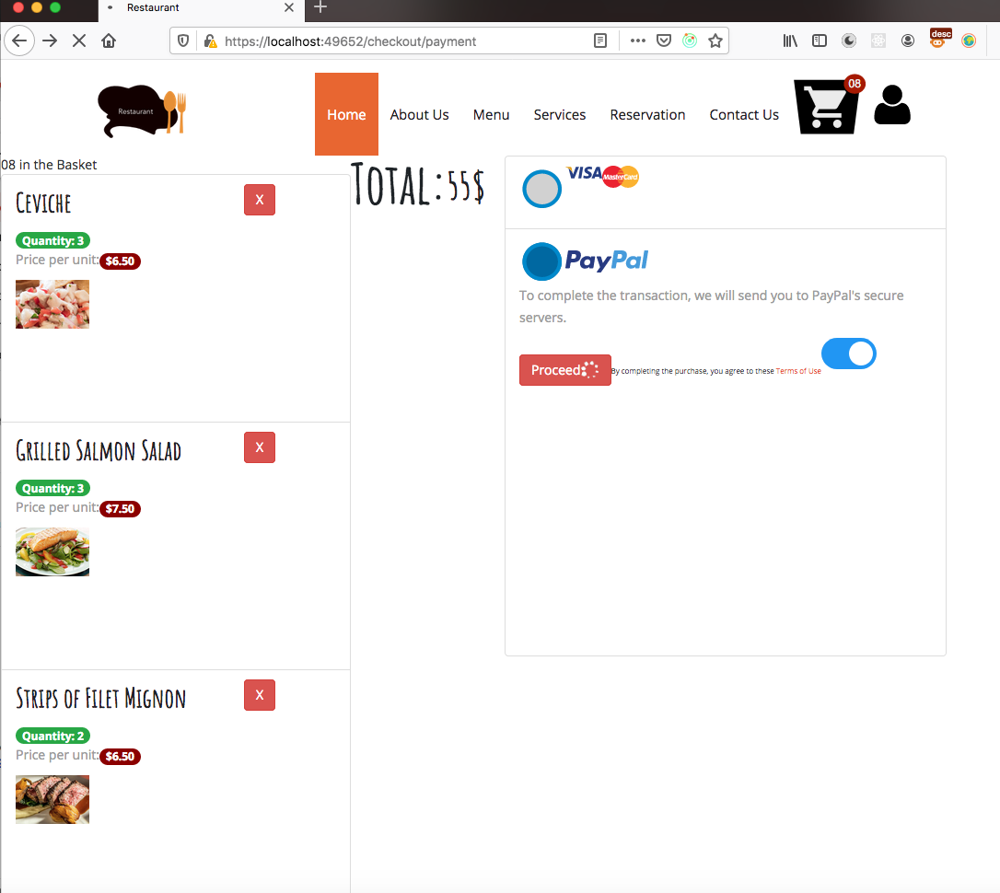
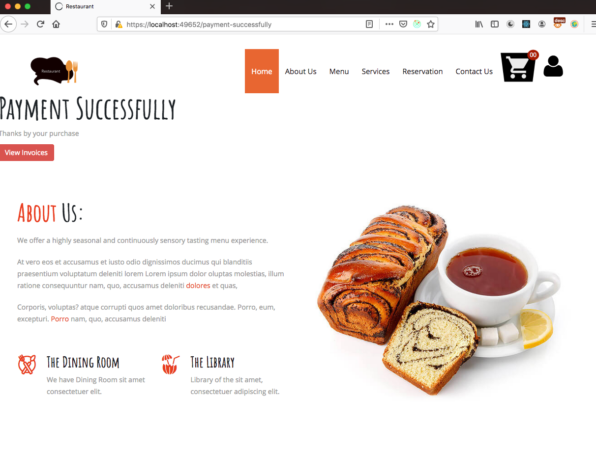

# React Redux Shopping Cart

React + Redux Thunk + Node-JS + MySQL

This project require another project as BackEnd [Server Nodejs](https://github.com/LeoCR/server-restaurant-client)

## User Interfaces

### View Orders

### Pay with Credit Card

### Pay with Paypal

### Payment Successfully

This project was splitted in 2 more differents projects:

<ul>
    <li><a href="https://github.com/LeoCR/react-redux-shopping-cart-restaurant" target="_new">Shopping Cart Restaurant</a></li>
    <li><a href="https://github.com/LeoCR/react-redux-users-restaurant" target="_new">Users Restaurant</a></li>
</ul>

This project was bootstrapped with [Create React App](https://github.com/facebook/create-react-app).

## Available Scripts

In the project directory, you can run:

### `npm start`

Runs the app in the development mode. 
Open [http://localhost:3000](http://localhost:3000) to view it in the browser.

### `npm test`

Launches the test runner in the interactive watch mode.

### `npm run build`

Builds the app for production to the `build` folder.

